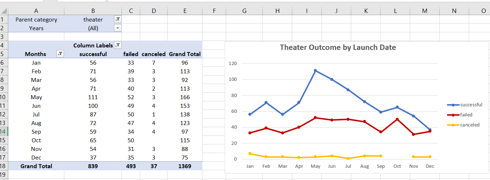
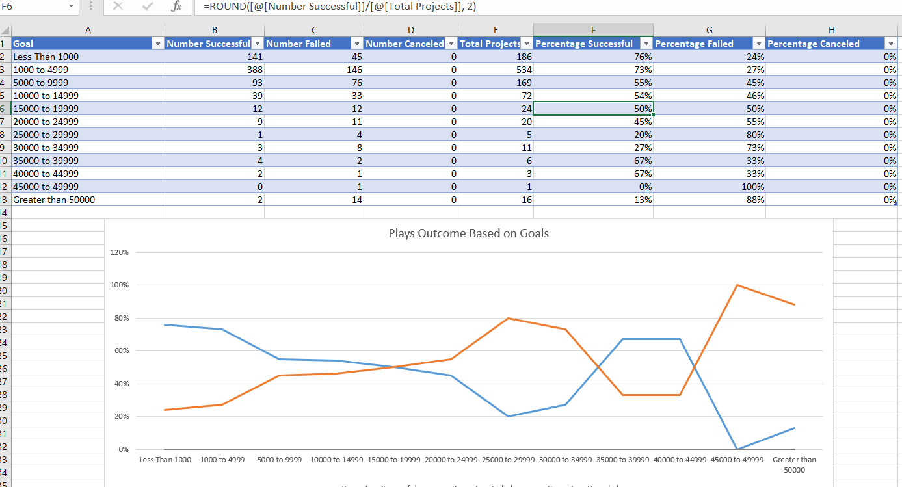
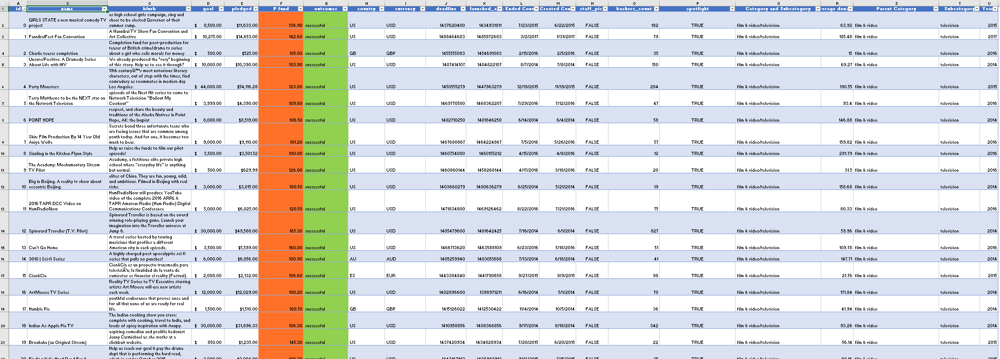

# Kickstarting with Excel

## Overview of Project
The goal of this project is to provide the playwright, Louis, with
recommendations regarding crowdfunding for her play ‘Fever’ and plan it to
be set up for success. These recommendations are based on insights drawn
from analyzing data of previous several thousand crowdfunding projects. 
be mirrored in hers.

### Purpose

The purpose of this analysis is to understand campaigns from start to finish.
Therefore, a dive in these data was needed to uncover any hidden trends and
understand if her goal of reaching \$10000 is possible in the timeline she
has in mind. Also, to identify any factors which played role in making a
successful crowdfunding that matches the same targeted category which could

### Analysis of Outcomes Based on Launch Date

As requested in the deliverables, the length of fundraising campaigns is a
valuable piece of data that will be needed to plan the upcoming crowdfunding, so
identifying the existing of a correlation between the length of a campaign and
its success was vital. Therefore, a closer look at how campaign length might be
tied to its outcome was done. (see img 2)

(img 2, theater outcome by launch date)

### Analysis of Outcomes Based on Goals

The second deliverable was to identify the ‘Outcomes based on goals’ which
analyze the correlation between the amount of the goal and the highest chances
achieving it. COUNTIFS, ROUND and AVARAGE were used to identify the numbers
which offer the required deliverables. (see img 3)

(Img 3, Outcomes based on goals)

### Challenges and Difficulties Encountered
First the data needed to be organized in the Kickstarter sheet as a table then
sort it in a way that would make it more readable and searchable and therefore
easier to analyze, taking a general overlook on the data was helpful to plan the
next step.

A deep look into the data was helpful to understand what type of data was
offered. The next step was to create the change the formatting of some columns,
one of the challenges we faced was the format of the timestamp and the dates, it
was solved by changing the format. Also, filtering, sorting and conditional
formatting were performed to customize the worksheet and refine the visual
presentation of the data to provide Louise with information at a glance. Later,
pivot table and pivot chart were created to add more customization to the data
in order to provide a visual feedback. (see img 1)

(img1. A full data overlook table)

## Results

-   In order to visualize the Theater outcome by launch date, a pivot table
was created relying on the sorted and filtered data in the main
‘Kickstarter’ sheet, which holds all the data we have. The goal was to
understand the relation between campaign launch dates and its time of
the year, the results show that crowdfunding for theater tends to be
more successful between April to August, and failed ones are between Dec
to Mar.

-   Another key finding was to identify the chance for success in relation
to the overall campaign funding goal, in short, the findings suggested
that Louise has 54% chance to reach her 10K goal, and the chances of her
getting fully funded means that she needs to reduce the goal to under 5K
which will raise the possibility to more than \~ %70.

-   The offered data was good, the limitation that could’ve improved the
results knowing the means of crowding and the what platforms were used,
and the age groups, income..etc for the targeted doners.

-   More work need to be done on finding the relation between successful
campaigns and their launch dates, and the overall goal of the
crowdfunding campaign, which means, maybe during summer doners are
willing to pay more, which means 10K goal can be achieved only during
summer, this is just a possibility that needs to be explored.
